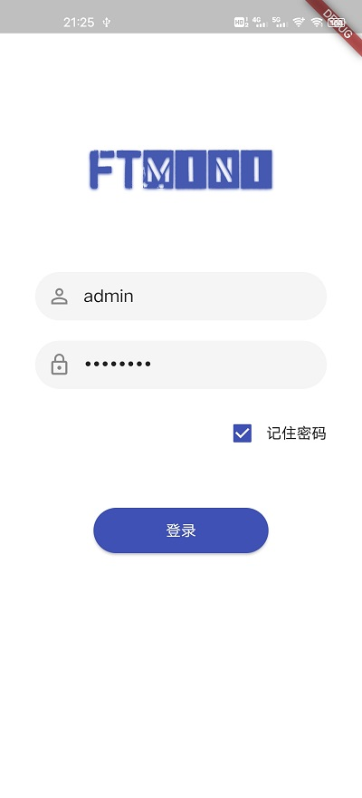
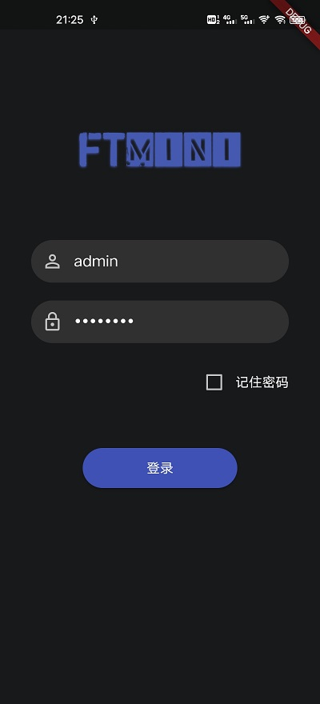

## 简介

一个 APP 项目 mini 模板，提供 HTTP、路由、本地缓存等常用功能的封装

## 效果图




## 版本

[plus](https://github.com/un-pany/flutter-template-plus) | [mini](https://github.com/un-pany/flutter-template-mini)

## 功能

```text
- 身份认证
  - 登录
  - 登出

- HTTP
  - 基于三方库 Dio 封装
  - 响应拦截

- 路由
  - 封装 Navigator 1.0
  - 路由拦截

- 状态管理
  - 基于三方库 provider
  - 黑暗模式

- 本地缓存
  - 基于三方库 shared_preferences 的封装

- 其他
  - 项目预初始化
  - 两次返回确认
```

## 目录结构

```
# flutter_template_mini
├─ assets             # 静态资源
│  ├─ icons           # 字体图标
│  ├─ images          # 图片
│  ├─ jsons           # json 文件
├─ lib
│  ├─ common          # 全局公共类、方法、变量等
│  ├─ db              # 本地缓存
│  ├─ http            # http
│  │  ├─ api
│  │  └─ request
│  ├─ models          # model 层
│  ├─ navigator       # Navigator 1.0
│  ├─ pages           # 所有页面
│  ├─ provider        # 状态管理
│  ├─ utils           # 工具类
├─ └─ main.dart       # 入口
└─ pubspec.yaml       # 包管理
```

## 开发

```bash
# 安装依赖
flutter packages get 或 flutter pub get

# 分析代码
flutter analyze

# 运行项目
flutter run

# 如果遇到着色器渲染错误（Shader compilation error），可以运行 clean 后再 run
flutter clean

# 安卓真机调试
flutter devices
flutter run

# 安卓打包
flutter build apk
```

## 开发环境

1. Flutter version 2.8.0
2. Dart version 2.15.0
3. Android SDK version 31.0.0

## 开发工具

1. 编辑器 Visual Studio Code
2. 插件 Dart
3. 插件 Flutter
4. 插件 Flutter Widget Snippets

## Git 提交规范

- `feat` 增加新功能
- `fix` 修复问题/BUG
- `style` 代码风格相关无影响运行结果的
- `perf` 优化/性能提升
- `refactor` 重构
- `revert` 撤销修改
- `test` 测试相关
- `docs` 文档/注释
- `chore` 依赖更新/脚手架配置修改等
- `workflow` 工作流改进
- `ci` 持续集成
- `types` 类型定义文件更改
- `wip` 开发中
- `mod` 不确定分类的修改

## ❓ 关于 JSON 转 Dart Model 类

1. 纯手写实体类（不推荐）
2. **用网页自动生成工具: 根据 JSON 自动生成实体类，并 copy 到项目中（所有项目都通用）**
3. 使用插件 json_serializable（更适合大型项目）

**该脚手架采用第二种方案**

这里随便提供一个自动生成的网址：[json_to_dart](https://javiercbk.github.io/json_to_dart/)

*JSON <——> Map <——> Dart Model 三者之间的转化是常用的技巧*

## ❓ 关于路由

1. **官方的 Navigator 1.0**
2. 官方的 Navigator 2.0 （Flutter 1.22 推出）
3. 三方插件 fluro

**该脚手架采用第一种方案，并对其封装**

*Navigator 2.0 的概念有一定的难度*

## ❓ 关于 flutter_template_plus 和 flutter_template_mini

1. mini 版的路由采用 Navigator 1.0，逻辑简单易懂，而 plus 版则采用更加强大，但难以理解的 Navigator 2.0
2. mini 版的 HTTP 层直接基于 Dio 进行封装，代码结构清晰简单，而 plus 版则书写一方库 MyNet，通过适配器集成 Dio，更加灵活、可插拔
3. mini 版的 db 层直接基于 shared_preferences 进行封装，而 plus 版则基于 shared_preferences 书写一方库 MyCache
4. mini 版的封装方式更贴近现代前端工程，而 plus 版则更加**面向对象**

## 📚 入门 Flutter 系列文章

1. [Flutter 从 0 到 1](https://juejin.cn/column/6995160230476644366)
2. [移动端学习小记](https://juejin.cn/column/6991310785871872007)

## 📄 License

[MIT](https://github.com/un-pany/flutter-template-mini/blob/main/LICENSE)

Copyright (c) 2021 UNPany
